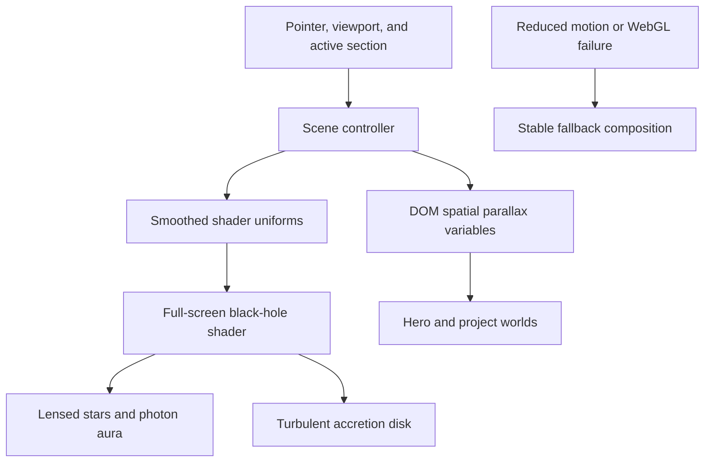

# Interactive Black Hole Portfolio - Plan

## Goal Capsule

- **Objective:** Replace the static astronaut artwork and diagram-like black-hole treatments with a continuous real-time black-hole experience that frames the portfolio as a spatial gallery.
- **Product authority:** The confirmed direction is gravity-lens gallery C for a creative-tech audience, with a larger singularity, a layered photon-ring aura, and strong pointer response.
- **Execution profile:** Preserve portfolio content, section anchors, contact links, and project data while overhauling the visual system.
- **Stop conditions:** Do not ship a static hero image, unbounded GPU work, pointer-only navigation, or motion without reduced-motion and WebGL fallbacks.
- **Tail ownership:** Complete local verification, commit on a feature branch, push, and open a pull request.

---

## Product Contract

### Summary

The portfolio becomes a continuous interactive space scene centered on a physically informed black-hole shader. The singularity is the dominant visual object, and portfolio projects behave like worlds positioned within its gravitational field.

### Problem Frame

The current hero depends on `public/images/zakaria-black-hole-hero.png`, while the live scene renders only a star field, sphere, flat ring, and point light. The result reads as a static sci-fi page with a decorative 3D layer instead of authored real-time art.

### Requirements

**Black-hole art**

- R1. Remove the astronaut PNG and every runtime reference to it.
- R2. Render a large procedural singularity with an event-horizon shadow, turbulent accretion disk, upper and lower lensed disk images, Doppler-brightened material, and multiple photon-ring bands.
- R3. Use a restrained off-black, hot-white, and amber-orange palette derived from the supplied reference rather than the existing cyan-violet glow language.

**Interaction and narrative**

- R4. Pointer movement must change the camera relationship, lensing center, disk perspective, and nearby spatial motion with damped response.
- R5. Scroll and active-section state must change scene scale, position, exposure, and intensity without turning the site into a scripted video.
- R6. Projects remain keyboard-selectable and readable while appearing to occupy a gravity-lens gallery around the singularity.

**Reliability and access**

- R7. Preserve the existing anchors `profile`, `projects`, `trajectory`, `systems`, and `contact` plus the current project and identity content.
- R8. Reduced-motion mode must render a stable high-quality frame and disable pointer and perpetual scene motion.
- R9. Mobile and low-capability devices must receive capped pixel density, lower shader cost, and a legible fallback if WebGL cannot initialize.
- R10. The initial hero must remain readable, fit within the dynamic viewport, and expose its primary actions without scrolling.

### Key Flow

- F1. A visitor lands on `profile`, sees the live singularity immediately, and can move the pointer to bend the view before choosing a primary action.
- F2. Scrolling changes the camera treatment while DOM content remains stable and accessible above the canvas.
- F3. In `projects`, the singularity grows and project objects become the primary interactive layer; selecting one updates the dossier without resetting the scene.
- F4. Reduced-motion or unavailable WebGL keeps every section and action usable with a stable visual fallback.

### Acceptance Examples

- AE1. Given a pointer-capable desktop, when the pointer crosses the hero, then the lens center, disk tilt, star deflection, and nearby content parallax respond smoothly without React rerenders per frame.
- AE2. Given the projects section is active, when a project is selected with mouse or keyboard, then the dossier changes and the selected world receives a visible state while the black-hole scene continues uninterrupted.
- AE3. Given reduced motion is enabled, when the page loads, then the scene renders a static composition and all scroll-linked or pointer-linked movement is disabled.
- AE4. Given WebGL initialization fails, when the page loads, then the portfolio remains legible and navigable with no blank full-screen region.

### Scope Boundaries

- Preserve the single-page information architecture, portfolio data, URLs, metadata, and contact destinations.
- Replace the visual language and spatial interaction system without adding a CMS, new project pages, audio, generated imagery, or downloaded 3D models.
- Treat the shader as a qualitative real-time visualization informed by black-hole optics, not a scientific general-relativistic ray tracer.

### Success Criteria

- No PNG, video, or photographic asset supplies the black-hole hero.
- The black hole dominates the hero and projects composition at desktop and mobile sizes.
- Pointer response is obvious within one movement but remains damped and controllable.
- Production build and lint complete successfully with no new console errors in the tested flow.

---

## Planning Contract

### Key Technical Decisions

- KTD1. Use a full-screen custom fragment shader in the existing React Three Fiber canvas. A single GPU quad can express lensing, photon rings, disk turbulence, Doppler brightness, star deflection, and exposure without asset downloads or thousands of DOM nodes.
- KTD2. Keep continuous values inside the render loop and shader uniforms. React state continues to represent discrete section and project selection only.
- KTD3. Keep portfolio content in DOM layers above the canvas. This preserves semantic navigation, text selection, keyboard access, and SEO while WebGL owns atmosphere and spatial response.
- KTD4. Use active-section presets instead of a fixed cinematic timeline. The scene interpolates between authored compositions while visitors retain normal scrolling.
- KTD5. Degrade by capability. Pixel ratio, detail, and animation respond to viewport, reduced-motion preference, and renderer availability.

### High-Level Technical Design

### Assumptions

- The existing `three`, `@react-three/fiber`, and `@react-three/drei` dependencies remain the rendering foundation.
- The page stays intentionally dark because the black-hole art cannot retain its physical contrast in an automatic light theme.
- Browser interaction and visual verification are the primary evidence for the shader because the repository has no automated browser or component test harness.

### Sequencing

Build the shader and scene controller first, then integrate the hero and project gallery against its presets. Complete responsive and fallback states before visual polish so performance limits shape the final art rather than being patched afterward.

---

## Implementation Units

### U1. Procedural singularity renderer

- **Goal:** Replace the primitive sphere-and-ring scene with a larger physically informed black-hole shader.
- **Requirements:** R2, R3, R9
- **Dependencies:** None
- **Files:** Modify `src/components/scene/SpaceScene.tsx`; create `src/components/scene/blackHoleShader.ts`.
- **Approach:** Render a full-screen plane with time, resolution, pointer, section, intensity, and quality uniforms. Combine bent star sampling, a thin turbulent disk, lensed far-side arcs, asymmetric brightness, photon-ring bands, and tone mapping in one fragment shader.
- **Patterns to follow:** Reuse the existing React Three Fiber `Canvas`, capped DPR, seeded scene behavior, and client-component boundary in `src/components/scene/SpaceScene.tsx`.
- **Test scenarios:** Render the hero on a WebGL-capable desktop and confirm the singularity fills the intended composition; resize across desktop and mobile aspect ratios and confirm the shadow remains circular while the disk stays edge-on; inspect console output for shader compile or WebGL errors.
- **Verification:** The rendered scene contains no geometry-based flat ring, keeps a stable frame at each tested aspect ratio, and compiles in the production build.

### U2. Reactive scene controller

- **Goal:** Make the black hole visibly respond to pointer, scroll context, and section changes without frame-driven React state.
- **Requirements:** R4, R5, AE1
- **Dependencies:** U1
- **Files:** Modify `src/components/scene/SpaceScene.tsx` and `src/components/PortfolioExperience.tsx`.
- **Approach:** Smooth pointer and preset values inside `useFrame`, derive section presets from the existing active-section state, and expose low-frequency DOM motion through CSS custom properties only where needed.
- **Execution note:** Prefer browser interaction evidence over unit coverage because continuous GPU uniforms and perceived damping are the behavior under test.
- **Patterns to follow:** Keep `IntersectionObserver` for discrete active-section detection and Framer Motion values for scroll progress.
- **Test scenarios:** Move the pointer across each quadrant and confirm directionally correct lens and camera response; move rapidly between extremes and confirm damping prevents snapping; navigate by anchor and confirm the scene interpolates rather than resets; select projects repeatedly and confirm the render loop remains continuous.
- **Verification:** Interaction is obvious, smooth, and free of per-frame React updates or accumulating listeners.

### U3. Spatial hero and gravity-lens gallery

- **Goal:** Remove the static image composition and make the live singularity the hero and project-stage focal point.
- **Requirements:** R1, R6, R7, R10, AE2
- **Dependencies:** U1, U2
- **Files:** Modify `src/components/PortfolioExperience.tsx`, `src/components/ProjectSection.tsx`, and `src/app/globals.css`; delete `public/images/zakaria-black-hole-hero.png`.
- **Approach:** Simplify the hero around one compact identity statement and two actions. Retire CSS black-hole pseudo-elements, grid decoration, orbit-map SVG, fake telemetry, numbered visual labels, and cyan-violet glows. Position project worlds around the live singularity with clear selected, hover, focus, and active states.
- **Patterns to follow:** Preserve section IDs, project selection state, dossier content, visible focus treatment, and mobile single-column fallbacks.
- **Test scenarios:** Load the initial viewport and confirm the headline, statement, and actions remain readable over the shader; activate every project with mouse and keyboard and confirm the correct dossier; test anchors and external links; confirm no reference to the deleted PNG remains; verify the hero and navigation fit at narrow mobile widths.
- **Verification:** The experience reads as one spatial system rather than a static hero followed by an unrelated CSS diagram.

### U4. Capability fallbacks and final polish

- **Goal:** Make the cinematic treatment resilient across motion preferences, device capability, and responsive layouts.
- **Requirements:** R8, R9, AE3, AE4
- **Dependencies:** U1, U2, U3
- **Files:** Modify `src/components/scene/SpaceScene.tsx` and `src/app/globals.css`.
- **Approach:** Freeze shader time and pointer response for reduced motion, cap DPR and shader detail for compact viewports, provide a CSS fallback behind the canvas, and ensure overlays keep contrast without excessive glass or outer glow.
- **Execution note:** Use runtime smoke verification at desktop and mobile sizes; there is no existing automated visual-test harness to extend.
- **Test scenarios:** Emulate reduced motion and confirm a stable frame with normal content navigation; emulate a compact viewport and confirm reduced detail with no clipping; inspect the fallback with canvas hidden; verify focus states and text contrast across every section.
- **Verification:** The site remains complete when animation is reduced or WebGL is absent, and high-motion mode does not sacrifice navigation or legibility.

---

## Verification Contract

| Gate | Applies to | Done signal |
|---|---|---|
| `npm run lint` | U1-U4 | ESLint exits successfully with no new warnings or errors. |
| `npm run build` | U1-U4 | Next.js production build and TypeScript compilation complete successfully. |
| Desktop browser QA | U1-U4 | Hero, pointer response, anchors, project selection, and console remain healthy at a desktop viewport. |
| Mobile browser QA | U3-U4 | The layout, controls, shader composition, and dossier remain usable below 700px. |
| Reduced-motion QA | U2, U4 | The scene is stable and all content remains usable with reduced motion enabled. |
| Static asset audit | U3 | No source or stylesheet references `zakaria-black-hole-hero.png`. |

---

## Definition of Done

- U1-U4 satisfy their verification outcomes and applicable acceptance examples.
- The old PNG and CSS black-hole illustration are absent from the runtime and repository.
- The final page contains no visible em dash, decorative section numbering, fake telemetry, scroll cue, or generated hero artwork.
- Every existing portfolio section, project, anchor, and contact link remains available.
- Lint and production build pass.
- Desktop, mobile, reduced-motion, and fallback states are exercised in a browser with no new attributable console errors.
- Experimental shader or layout attempts that did not ship are removed from the diff.
- The feature branch is committed, pushed, and represented by an open pull request.

---

## Appendix

### Sources and Research

- `src/components/scene/SpaceScene.tsx` establishes the existing React Three Fiber scene boundary and performance caps.
- `src/components/PortfolioExperience.tsx` owns section state and the semantic DOM experience above the scene.
- `src/components/ProjectSection.tsx` owns project selection and the current CSS orbital field.
- NASA Scientific Visualization Studio, "Black Hole with Accretion Disk Visualization" (2024), supports the lensing, Einstein-ring, Doppler-beaming, and flat-disk visual treatment.
- NASA Goddard, "NASA Visualization Shows a Black Hole's Warped World" (2019), supports the multiple photon-ring bands and turbulent bright-knot treatment.
- Three.js `ShaderMaterial` and `WebGLRenderer` documentation supports the custom GPU-shader approach on the repository's installed rendering stack.
